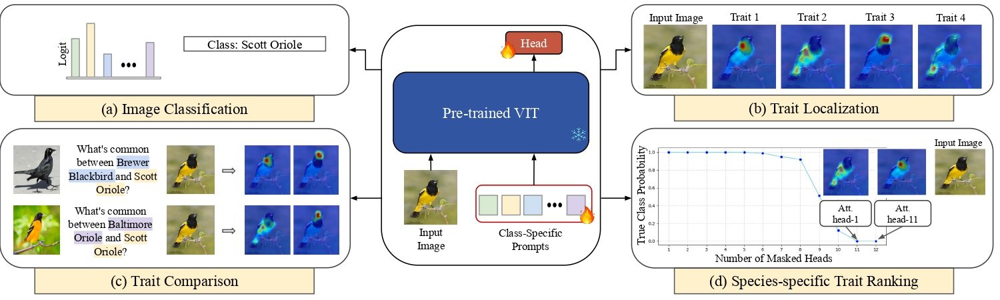

# :mag: Prompt-CAM: Making Vision Transformers Interpretable for Fine-Grained Analysis(CVPR'25)

This is an official implementation for [PROMPT-CAM: Making Vision Transformers Interpretable for Fine-Grained Analysis](https://arxiv.org/pdf/2501.09333) (CVPR'25)

Introducing **Prompt-CAM**, a $${\textcolor{red}{\text{simple yet effective}}}$$ **interpretable transformer** that requires no architectural modifications to pre-trained ViTs, we just have to inject **class-specific prompts** into any ViT to make them interpretable.

Prompt CAM lets us explore:
- 🧠 What the model thinks is important for each class?
- ✨ Which traits are shared between two bird species?
- 🎨 How different classes ‘see’ the same image differently!

<p align="center">

</p>

## Quick Start: Try out the demo
🔍 Ever wondered what traits stand out when a model looks at an image of one class but searches with another class in mind? 🤔
Witness the important traits of different class through the lens of Prompt-CAM with our interactive demos! 

👉 Try our demo **without installing anything** in Gooogle Colab [](https://colab.research.google.com/drive/1co1P5LXSVb-g0hqv8Selfjq4WGxSpIFe?usp=sharing)

👉 Try our demo locally in [](demo.ipynb)
- Setup the [envoiroment](#environment-setup)
- download the pre-trained model from link below!
- run the demo.


👉  You can extend this code base to include: [New datasets](#to-add-a-new-dataset) and [New backbones](#to-add-a-new-backbone) 

## 👥 Twin Face Verification (NEW!)

We've extended Prompt-CAM for **identical twin face verification** - a challenging fine-grained task where the model must distinguish between highly similar twin faces.

### Key Features:
- **Person-specific prompts**: Each person gets their own prompt to capture unique facial traits
- **Two-stage training**: Stage 1 (identity classification) → Stage 2 (verification)
- **Hard negative mining**: Uses actual twin pairs as challenging negative examples
- **Interpretable results**: Visualize which facial features the model focuses on

### Important Notes:
- **Batching Constraint**: Due to the person-specific prompt mechanism, all images in a single batch must correspond to the same person during training. The dataloader handles this automatically for identity classification training.
- **Memory Efficiency**: The model uses prompt swapping rather than computing separate forward passes for each person, making it memory efficient.
- **Interpretability**: Person-specific prompts allow visualization of which facial features each person's model focuses on.

### Dataset Requirements:
Your face images should be:
- **Pre-processed**: Face aligned, cropped to face-only regions, and **already resized to 224×224 pixels**
- **Format**: Standard image formats (JPG, PNG)
- **Organization**: Follow the JSON structure described below

### Dataset Structure:
```
data/
├── train_dataset_infor.json    # {"person_id": ["path1.jpg", "path2.jpg", ...]}
├── train_twin_pairs.json       # [["person1", "person2"], ["person3", "person4"], ...]
├── test_dataset_infor.json     # Same format as train
└── test_twin_pairs.json        # Same format as train
```

### Quick Start - Twin Verification:
```bash
# Test the implementation
python test_implementation.py

# Train with DINOv2 backbone (RECOMMENDED - tested and working)
python main.py --config experiment/config/twin_verification/dinov2/args.yaml

# Train with DINO backbone  
python main.py --config experiment/config/twin_verification/dino/args.yaml
```

**✅ Status**: The twin verification implementation is now fully functional and tested on Kaggle with DINOv2 backbone, achieving 100% accuracy on Stage 1 identity classification.

### Image Processing:
**🔧 Minimal Processing**: Since your images are already preprocessed to 224×224 pixels, the code only applies essential transforms:

```python
# Only essential transforms applied:
transforms.ToTensor()                   # Convert to tensor
transforms.Normalize(                   # ImageNet normalization
    mean=[0.485, 0.456, 0.406], 
    std=[0.229, 0.224, 0.225]
)
```

**No resizing, cropping, or other preprocessing** - your images are loaded directly as-is.

### Kaggle Usage:
```python
# For Kaggle environment, set up WandB tracking:
import os
from kaggle_secrets import UserSecretsClient

user_secrets = UserSecretsClient()
os.environ["WANDB_API_KEY"] = user_secrets.get_secret("WANDB_API_KEY")

# Run training (configs are already set for WandB)
!python main.py --config experiment/config/twin_verification/dinov2/args.yaml
```

## Environment Setup  
```bash 
conda create -n prompt_cam python=3.7
conda activate prompt_cam  
source env_setup.sh
```  


## Data Preparation
You can put all the data in a folder and pass the path to `--data_path` argument.

The structure of `data/images/`should be organized as follows:

```
cub/
├── train/
│   ├── 001.Black_footed_Albatross/
│   │   ├── image_1.jpg
│   │   ├── image_2.jpg
│   │   └── ...
│   ├── 002.Laysan_Albatross/
│   │   ├── image_1.jpg
│   │   ├── image_2.jpg
│   │   └── ...
│   └── ...
└── val/
    ├── 001.Black_footed_Albatross/
    │   ├── image_1.jpg
    │   ├── image_2.jpg
    │   └── ...
    ├── 002.Laysan_Albatross/
    │   ├── image_1.jpg
```

<details>
<summary>Prepare CUB dataset</summary>

## CUB

- Download prepared dataset
    - From [](https://drive.google.com/drive/folders/1X3ikQEk_D7cKcyCnxbF3kJTsZ0LZfvVO?usp=sharing)
- `Or` Prepare the dataset by yourself
    - You can download the CUB dataset from [the original website](https://www.vision.caltech.edu/datasets/cub_200_2011/) and put it in the `data/images/` folder.
    - You can use the dataset's provided train/val split to create the train/val splits and have their class numbers as the `prefix` of the respective image folder names(starting from 1).
    - The code will automatically create train and val annotation files in the `data/annotations/` folder for each dataset if not provided.

</details>
<details>
<summary>Prepare Oxford Pet dataset</summary>

## Pet Dataset
- Download prepared dataset
    - From [](https://drive.google.com/drive/folders/1X3ikQEk_D7cKcyCnxbF3kJTsZ0LZfvVO?usp=sharing)
</details>

**To add new dataset, see [Extensions](#extensions)**

## Results + Checkpoints:
- Download from the links below and put it in the `checkpoints/{model}/{dataset}/` folder.

Backbone | Dataset | Prompt-CAM(Acc top%1) | Checkpoint Link|
--- | --- | --- | --- |
dino | cub (CUB)| 73.2 | [url](https://drive.google.com/drive/folders/1UmHdGx4OtWCQ1GhHCrBArQeeX14FqwyY?usp=sharing) |
dino | car (Stanford Cars) | 83.2 | [url](https://drive.google.com/drive/folders/1UmHdGx4OtWCQ1GhHCrBArQeeX14FqwyY?usp=sharing) |
dino | dog (Stanford Dogs) | 81.1 |[url](https://drive.google.com/drive/folders/1UmHdGx4OtWCQ1GhHCrBArQeeX14FqwyY?usp=sharing) |
dino | pet (Oxford Pet) | 91.3 | [url](https://drive.google.com/drive/folders/1UmHdGx4OtWCQ1GhHCrBArQeeX14FqwyY?usp=sharing) |
dino | birds_525 (Birds-525) | 98.8 | [url](https://drive.google.com/drive/folders/1UmHdGx4OtWCQ1GhHCrBArQeeX14FqwyY?usp=sharing) |

Backbone | Dataset | Prompt-CAM(Acc top%1) | Checkpoint Link|
--- | --- | --- | --- |
dinov2 | cub (CUB) | 74.1 | [url](https://drive.google.com/drive/folders/1UmHdGx4OtWCQ1GhHCrBArQeeX14FqwyY?usp=sharing) |
dinov2 | dog (Stanford Dogs) | 81.3| [url](https://drive.google.com/drive/folders/1UmHdGx4OtWCQ1GhHCrBArQeeX14FqwyY?usp=sharing) |
dinov2 | pet (Oxford Pet) | 92.7 | [url](https://drive.google.com/drive/folders/1UmHdGx4OtWCQ1GhHCrBArQeeX14FqwyY?usp=sharing) |

## Evaluation and Visualization
- download the checkpoint from url in the [Table](#results--checkpoints) above and put it in the `checkpoints/{model}/{dataset}/` folder.

For example, to visualize the attention map of the DINO model on the class `024.Red_faced_Cormorant` of CUB dataset, put the checkpoint in `checkpoints/dino/cub/` folder and run the following command:

```python
CUDA_VISIBLE_DEVICES=0  python visualize.py --config ./experiment/config/prompt_cam/dino/cub/args.yaml --checkpoint ./checkpoints/dino/cub/model.pt --vis_cls 23
```

- The output will be saved in the `visualization/dino/cub/class_23/` folder. 
- Inside the individual image folder, there will be `top_traits` heatmaps for the target class concatenated if the prediction is correct. Otherwise, all the traits will be concatenated. (the prediction is for the respective image can be found `concatenated_prediction_{predicted_class}.jpg`).
<details>
<summary>Visualization Configuration Meaning</summary>

- `config`: path to the config file.
- `checkpoint`: path to the checkpoint file.
- `vis_cls`: class number to visualize. (default: 23)
- `vis_attn`: set to True to visualize the attention map. (default: True)
- `top_traits`: number of traits to visualize. (default: 4)
- `nmbr_samples`: number of images from the `vis_cls to visualize. (default: 10)
- `vis_outdir`: output directory. (default: visualization/)
</details>

### Model Evaluation and Testing:

After training is complete, evaluate your model performance and find the optimal threshold:

```bash
# Comprehensive evaluation on test set
python evaluate_twin_verification.py \
    --checkpoint ./output/twin_verification/.../checkpoint_stage2_best_epoch_X.pth \
    --config experiment/config/twin_verification/dinov2/args.yaml \
    --output_dir ./evaluation_results

# For Kaggle environment:
!python evaluate_twin_verification.py \
    --checkpoint /path/to/your/best/checkpoint.pth \
    --config experiment/config/twin_verification/dinov2/args.yaml \
    --output_dir /kaggle/working/evaluation_results
```

**Evaluation outputs:**
- 📊 **evaluation_plots.png**: ROC curves, confusion matrix, threshold analysis
- 📋 **evaluation_results.json**: Comprehensive metrics (AUC, EER, optimal threshold)
- 📝 **detailed_predictions.csv**: Per-sample predictions for error analysis

**Key metrics to look for:**
- **ROC AUC > 0.90**: Excellent discrimination ability
- **Equal Error Rate < 0.15**: Good balance of false positives/negatives  
- **Accuracy > 85%**: Strong overall performance
- **Twin Discrimination**: Performance on hardest cases (identical twins)

### Quick Performance Check:

For a quick evaluation without saving detailed results:

```python
import torch
from model.twin_prompt_cam import TwinPromptCAM, TwinPromptCAMConfig

# Load your best checkpoint
config = TwinPromptCAMConfig(model='dinov2', stage1_training=False)
model = TwinPromptCAM(config, num_persons=356)

checkpoint = torch.load('checkpoint_stage2_best_epoch_X.pth')
model.load_state_dict(checkpoint['model_state_dict'])
model.eval()

# Test on a pair of images
with torch.no_grad():
    similarity = model(img1, img2, person1_idx, person2_idx, mode='verification')
    probability = torch.sigmoid(similarity)
    
    # Use your optimal threshold (found from evaluation)
    is_same_person = probability > optimal_threshold
```
## :fire: Training

### :one: Pretrained weights
---

Download the pretrained weights from the following links and put them in the `pretrained_weights` folder.     
1. [ViT-B-DINO](https://dl.fbaipublicfiles.com/dino/dino_vitbase16_pretrain/dino_vitbase16_pretrain.pth) rename it as `dino_vitbase16_pretrain.pth`
2. [ViT-B-DINOV2](https://dl.fbaipublicfiles.com/dinov2/dinov2_vitb14/dinov2_vitb14_pretrain.pth) rename it as `dinov2_vitb14_pretrain.pth`
### :two: Load dataset
---

See [Data Preparation](#data-preparation) above.
### :three: Start training
---

👉 To train the model on the `CUB dataset` using the `DINO` model, run the following command:
```python
CUDA_VISIBLE_DEVICES=0  python main.py --config ./experiment/config/prompt_cam/dino/cub/args.yaml
```
The checkpoint will be saved in the `output/vit_base_patch16_dino/cub/` folder. Copy the checkpoint `model.pt` to the `checkpoints/dino/cub/` folder.

---

👉 To train the model on the `Oxford Pet dataset` using the `DINO` model, run the following command:
```python
CUDA_VISIBLE_DEVICES=0  python main.py --config ./experiment/config/prompt_cam/dino/pet/args.yaml
```
The checkpoint will be saved in the `output/vit_base_patch14_dino/pet/` folder. Copy the checkpoint `model.pt` to the `checkpoints/dino/pet/` folder.

---

👉 To train the model on the `Oxford Pet dataset` using the `DINOv2` model, run the following command:
```python
CUDA_VISIBLE_DEVICES=0  python main.py --config ./experiment/config/prompt_cam/dinov2/pet/args.yaml
```

The checkpoint will be saved in the `output/vit_base_patch14_dinov2/pet/` folder. Copy the checkpoint `model.pt` to the `checkpoints/dinov2/pet/` folder.

---

### :four: :mag: Visualize the attention map
---

See [Visualization](#evaluation-and-visualization) above.

## Extensions
### To add a new dataset
1. Prepare dataset using above [instructions](#data-preparation).
2. add a new dataset file in `/data/dataset`. [ Look at the existing dataset files for reference.](data/dataset/cub.py)
3. modify [build_loader.py](experiment/build_loader.py) to include the new dataset.
4. create a new config file in `experiment/config/prompt_cam/{model}/{dataset}/args.yaml` 
    - See `experiment/config/prompt_cam/dino/cub/args.yaml` for reference and what to modify.

### To add a new backbone
- modify `get_base_model()` in [build_model.py](experiment/build_model.py).
- register the new backbone in [vision_transformer.py](model/vision_transformer.py) by creating a new function.
- add another option in `--pretrained_weights` and `--model` in `setup_parser()` function of [main.py](main.py) to include the new backbone.


# Citation [](https://arxiv.org/pdf/2501.09333)
If you find this repository useful, please consider citing our work :pencil: and giving a star :star2: :
```
@article{chowdhury2025prompt,
  title={Prompt-CAM: A Simpler Interpretable Transformer for Fine-Grained Analysis},
  author={Chowdhury, Arpita and Paul, Dipanjyoti and Mai, Zheda and Gu, Jianyang and Zhang, Ziheng and Mehrab, Kazi Sajeed and Campolongo, Elizabeth G and Rubenstein, Daniel and Stewart, Charles V and Karpatne, Anuj and others},
  journal={arXiv preprint arXiv:2501.09333},
  year={2025}
}
```
### Acknowledgement

- VPT: https://github.com/KMnP/vpt 
- PETL_VISION: https://github.com/OSU-MLB/PETL_Vision  

Thanks for their wonderful works.

🛠 create an issue for any contributions.
